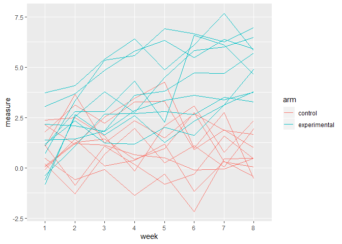
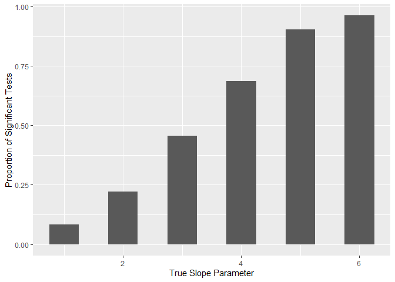
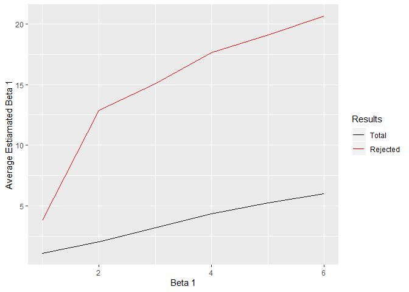

Homework 6
================
Madison Stoms
November 4, 2019

``` r
library(tidyverse)
```

    ## -- Attaching packages ------------------------------------ tidyverse 1.2.1 --

    ## v ggplot2 3.2.1     v purrr   0.3.2
    ## v tibble  2.1.3     v dplyr   0.8.3
    ## v tidyr   1.0.0     v stringr 1.4.0
    ## v readr   1.3.1     v forcats 0.4.0

    ## -- Conflicts --------------------------------------- tidyverse_conflicts() --
    ## x dplyr::filter() masks stats::filter()
    ## x dplyr::lag()    masks stats::lag()

``` r
set.seed(10)

iris_with_missing = iris %>% 
  map_df(~replace(.x, sample(1:150, 20), NA)) %>%
  mutate(Species = as.character(Species))
```

Problem 1
---------

``` r
#function to fill missing values
fill_na = function(x) {
  
  if (is.numeric(x)) { 
    
    replace_na(x, mean(x, na.rm = TRUE))
    
    }
  
  else if (is.character(x)) { 
    
    replace_na(x, "virginica")
    
  }
  
}

#map function over iris_with_missing
iris_filled = map(iris_with_missing, fill_na)
```

``` r
#function to read in files
read_in = function(x) {
  
  read.csv(str_c("data\\",  x))
  
}


#read in using map and tidy
trial = map_df(list.files("data"), read_in) %>%
  mutate(patient_id = 1:20,
         arm = c(rep("control", 10), rep("experimental", 10))
         ) %>%
  pivot_longer(cols = 1:8,
               names_to = "week", 
               names_prefix = "week_", 
               values_to = "measure")

#spaghetti plot
trial %>%
  ggplot(aes(x = week, y = measure, group = patient_id, color = arm)) +
  geom_line()
```



``` r
#fix values
n = 30
b_0 = 2
sig_2 = 50
x = rnorm(n)

model_generate = function(n , b_0, b_1, sig_2, x ) {

  e = rnorm(n, sd = sig_2)
  y = b_0 + b_1 * x + e
  results = lm(y~x)
  broom::tidy(results)[2, c(2, 5)]
  
}

sim_results = function(n, b_0, b_1, sig_2, x) {
  
  rerun(1000, model_generate(n, b_0, b_1, sig_2, x)) %>%
  bind_rows()
  
}


#results for B0 = 0
sim_results(n, b_0, b_1 = 0, sig_2, x) %>%
  bind_rows() %>%
  head()
```

    ## # A tibble: 6 x 2
    ##   estimate p.value
    ##      <dbl>   <dbl>
    ## 1    14.3   0.207 
    ## 2    15.3   0.208 
    ## 3     3.08  0.720 
    ## 4    19.7   0.144 
    ## 5    20.6   0.0761
    ## 6   -12.1   0.391

``` r
results = 
  tibble(b_1 = 1:6) %>%
  mutate(
    output_lists = map(.x = b_1, 
                       ~rerun(1000, model_generate(
                         n, b_0, b_1 = .x, sig_2, x))),
    estimate_dfs = map(output_lists, bind_rows) 
  ) %>%
  select(-output_lists) %>%
  unnest(estimate_dfs) %>%
  as.data.frame()

#power plot
results %>%
  mutate(rejected = ifelse(p.value < 0.05, 1, 0)) %>%
  group_by(b_1) %>%
  summarise(prop = mean(rejected)) %>%
  ggplot(aes(x = b_1, y = prop)) +
  geom_col(width = .5) +
  xlab("True Slope Parameter") +
  ylab("Proportion of Significant Tests") 
```



``` r
#average plot
sig = results %>%
  filter(p.value < 0.05) %>%
  group_by(b_1) %>%
  summarise(estimate_avg = mean(estimate)) 

results %>%
  group_by(b_1) %>%
  summarise(estimate_avg = mean(estimate)) %>%
  ggplot(aes(x = b_1, y = estimate_avg)) +
  geom_line(aes(color = "black")) +
  geom_line(data = sig,
            aes(color = "red")) +
  scale_color_manual(name = "Results", 
                     values = c("black", "red"),
                     labels = c("Total", "Rejected"))
```


